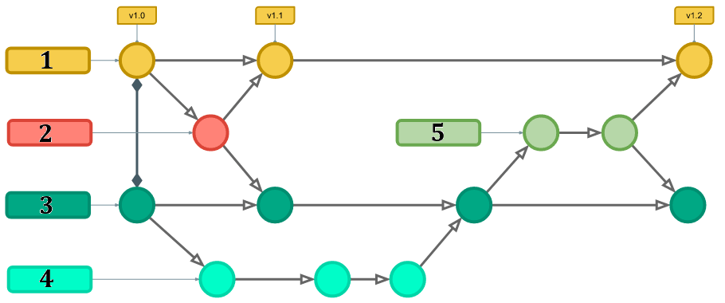

##   git#61-80

#### Q61. What command creates a new branch from the currently checked-out branch?

- [ ] `git -b checkout <nameOfBranch>`
- [ ] `git branch`
- [ ] `git checkout <nameOfBranch>`
- [x] `git checkout -b <nameOfBranch>`

#### Q62. After mistakenly staging a file named myFile to the index, how would you remove it from the index to exclude it from your next commit?

- [ ] Use git reset HEAD^.
- [x] Use git reset myFile.txt.
- [ ] Use git -rm myFile.txt.
- [ ] Use git reset.

#### Q63. What happens if you run this command from your master branch?

```bash
`git checkout -b beta-test
```

- [ ] The beta-test branch will be checked out of the current commit.
- [ ] The beta-test branch will be checked out and deleted.
- [x] A new branch called beta-test will be created and switched to.
- [ ] The beta-test branch will be merged with the master branch.

#### Q64. How does Git internally manage branches?

- [x] by creating a pointer to the most recent snapshot/commit for the branch.
- [ ] by creating a data array of branches in the same repository.
- [ ] by creating a data dictionary of code changes.
- [ ] be creating a debug log that stores repository changes.

#### Q65. You want to perform a git reset but cannot recall all of the available options. What command would you use to see a description of them?

- [x] git help reset
- [ ] git -h reset
- [ ] git options reset
- [ ] git reset help

#### Q66. What is a remote repository?

- [ ] a version of the repository that mirrors changes made in the local repository's master branch for open-source collaboration efforts
- [ ] the lead repository elected by the Git arbitrator found within local repositories of collaborating team members
- [ ] a read-only version of the repository stored on a backup server in case local repositories become lost or corrupted
- [x] a version of the repository hosted on the internet or network that is pushed to or pulled from by collaborators

#### Q67. After modifying some existing files in a repository, you decide to discard the changes. What command can you use?

- [ ] git restore
- [ ] git undo
- [ ] git clean
- [x] git checkout

#### Q68. After starting to merge a feature branch into your master branch, you encounter a merge conflict and decide you do not want to perform the merge. How can you stop the merge and restore to the pre-merge state?

- [ ] Use git restore -p.
- [ ] Use git merge -u.
- [x] Use git merge --abort.
- [ ] Use git merge --undo.

#### Q69. If you have several commits for a single feature, what is the most efficient way to restructure your commit history?

- [ ] Use git stash to consolidate the commits under a new hash.
- [x] Use git squash to consolidate the commits together into a single coherent commit.
- [ ] Delete the task commits and recommit with a new message.
- [ ] Use git cherry-pick to place the commits in another branch.

#### Q70. Which command correctly creates a lightweight tag?

- [x] `git tag v3.8.1`
- [ ] `git tag --light "v3.8.1"`
- [ ] `git tag v3.8.1 —-annotate -m "<tagMessage>"`
- [ ] `git tag -l v3.8.1`

#### Q71. What is the main issue with using git rebase when working with multiple developers?

- [ ] Rebase affects only your repository and creates a diff in the master branch.
- [ ] Rebase creates a temporary copy of the master branch in the remote repo.
- [ ] Rebase moves the HEAD of the remote master branch one commit forward.
- [x] Rebase deletes all commit history for the new feature branch.

#### Q72. What Git workflow is used by teams that collaborate on a single branch and avoid creating long-lived development branches?

- [ ] Git flow
- [ ] Mainline flow
- [x] Trunk-Based Development
- [ ] GitHub flow

#### Q73. Which option on the git log command allows you to limit output to commits made after certain data?

- [x] `--since`
- [ ] `--sinceWhen`
- [ ] `-<n>`
- [ ] `--afterDate`

#### Q74. How would you delete unreachable objects older than a specified time from your project database?

- [ ] `git cache --obsolete <time>`
- [ ] `git branch --rebase <time>`
- [ ] `git delete --inert <time>`
- [x] `git prune --expire <time>`

#### Q75. What conflicts can occur when forcing a push after rebasing?

- [x] The remote master branch could have existing changes overwritten.
- [ ] The origin URL will be reset to its default value.
- [ ] The current HEAD will be deleted and can't be reinstated.
- [ ] Nothing, it's common practice to force a push after rebasing.

#### Q76. How does this command alter the currently checked-out branch?

`git reset --soft HEAD^`

- [ ] It resets the working branch to the first commit.
- [x] It sets HEAD to previous commit and leaves changes from the undone commit in the stage/index.
- [ ] It deletes all previous commits and resets the repository history back to its initial state.
- [ ] It keeps the HEAD at the current commit, but clears all previous commits.

#### Q77. What is the difference between Git and SVN?

- [ ] Git works only on Linux, while SVN works on all operating systems.
- [ ] SVN works only on Linux, while Git works on all operating systems.
- [x] SVN is a centralized system, while Git is a distributed system.
- [ ] Git a centralized system, while SVN is a distributed system.

#### Q78. This command is an example of what kind of tag?

`git tag -a v1.4 -m "ABCD v1.5"`

- [ ] verbose
- [x] annotated
- [ ] lightweight
- [ ] deferred

#### Q79. What is the difference between a soft reset (`git reset --soft`) and a hard reset (`git reset –hard`) ?

- [x] A soft reset only changes the commit that HEAD points to, while a hard reset resets the index and working tree to match the specified commit, discarding any changes.
- [ ] A soft reset caches the old HEAD pointer, while a hard reset deletes it entirely.
- [ ] A hard reset changes only where the HEAD is pointing, while a soft reset changes the HEAD and index.
- [ ] A hard reset caches the old HEAD pointer, while a soft reset deletes it entirely.

#### Q80. Consider the following Git workflow:

`
`Which of the following options is correct ?

- [ ] `1. Develop 2. Release 3. Hotfix 4. Feature 5. Master`
- [ ] `1. Master 2. Release 3. Hotfix 4. Feature 5. Develop`
- [ ] `1. Develop 2. Master 3. Hotfix 4. Feature 5. Develop`
- [x] `1. Master 2. Hotfix 3. Develop 4. Feature 5. Release`

